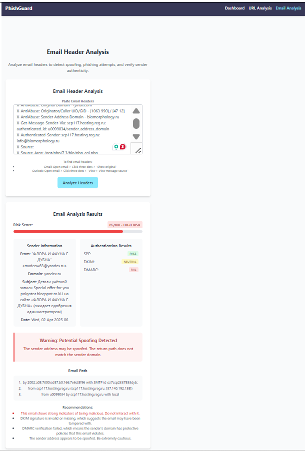

# PhishGuard 🛡️


*A modern phishing detection toolkit for cybersecurity professionals*

---

## 🚀 Features

### 🔍 Multi-Analysis Capabilities
- **Email Header Analysis**: Detect spoofing attempts via SPF/DKIM/DMARC verification  

- **Risk Scoring System**: Visual risk meter with low/medium/high classification  
- **Received Chain Visualization**: Interactive email path tracing
- **Dark Mode Support**: Optimized for low-light environments

### 📱 Fully Responsive Design
- Mobile-first layout using Tailwind CSS breakpoints  
- Adaptive grids and cards for all screen sizes  


### 🛡️ Security Insights
- Real-time authentication results
- Spoofing detection alerts
- Actionable security recommendations

---

## ⚙️ Tech Stack

**Frontend**  
[](https://react.dev/)
[](https://tailwindcss.com/)

**State Management**  
[](https://zustand-demo.pmnd.rs/)

**Routing**  
[](https://reactrouter.com/)

---

## 🖥️ Usage

### Email Analysis Workflow
1. Navigate to Email Analysis  

2. Paste raw email headers
3. View comprehensive analysis  


### Key Interactions
- Risk score progress bar with color-coded levels
- Expandable authentication details
- Scrollable email path visualization

---

## 🧪 Testing Matrix

| Device Type       | Test Coverage          |
|-------------------|------------------------|
| Mobile (≤768px)   | Full responsive layout |
| Tablet (769-1024px)| Optimized grids       |
| Desktop (≥1025px) | Full feature set       |

---

## 🤝 Contributing

1. Fork the Project
2. Create your Feature Branch
```bash
git checkout -b feature/amazing-feature
```
3. Commit Changes
```bash
git commit -m 'Add some amazing feature'
```
4. Push to Branch
```bash
git push origin feature/amazing-feature
```
5. Open a Pull Request

---

## 📄 License

Distributed under the MIT License. See `LICENSE` for more information.

---

## 🎯 Roadmap

- [ ] URL Analysis Module
- [ ] Visual Content Detection
- [ ] PDF Report Generation
- [ ] Multi-user Support

---

## 🙏 Acknowledgements

- Vite for blazing-fast builds
- Heroicons for beautiful SVG icons
- Cybersecurity community for threat intelligence patterns

```